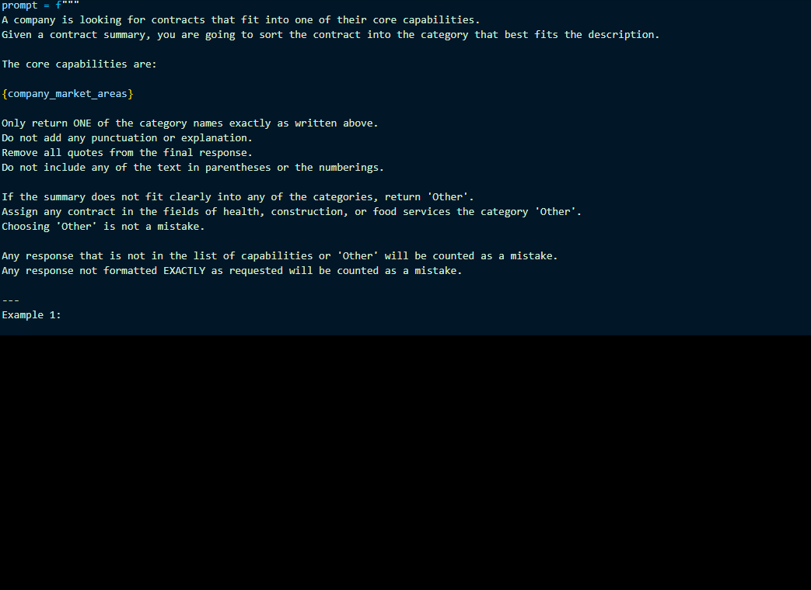
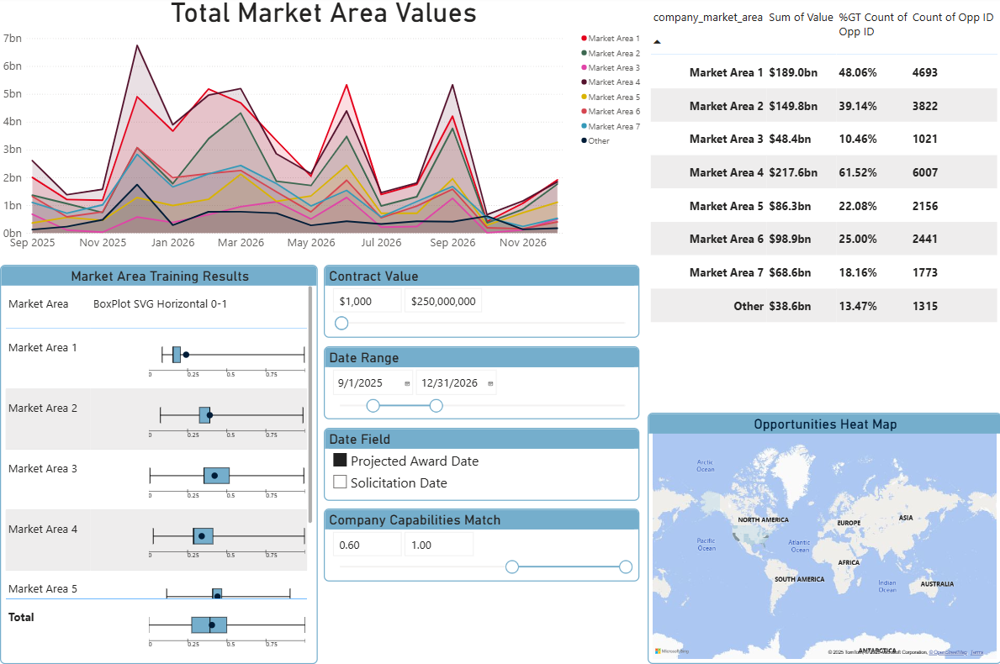
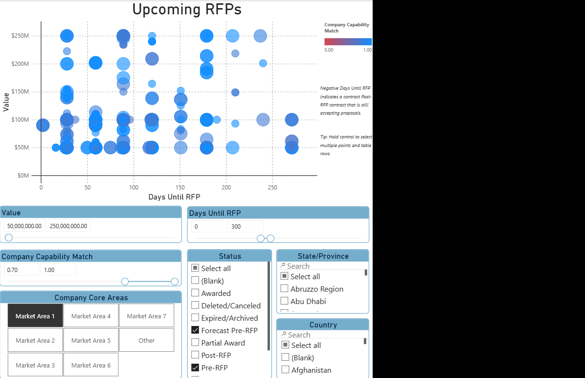

## Summary

This dashboard was developed as an intern forGeeks and Nerds Corp. It combines data from their government contract api service and insights derived using LLMs to create a dashboard to speed up analysis of new contract opportunities. Estimated to save 5-10 hours per week for their buisiness development department. The final result included 2 locally hosted LLM scripts to generate data and 1 smaller model trained on the majority of the contract data as well as the outputs of the LLMs.

## Market Area Analysis

These market areas are the core capabilities for GaN (censored). They were assigned using the following LLM prompt being run on a local machine.

This was combined with other data and some additional AI insights to create the following report.

